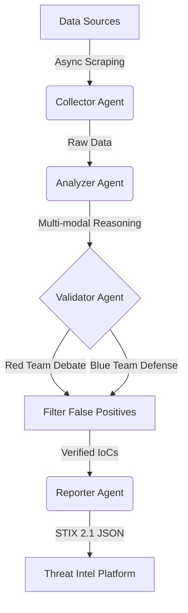

# OSINT Agent Network (OAN)


## 📌 Overview
**OSINT Agent Network (OAN)** is an automated Open Source Intelligence (OSINT) analysis system powered by Multi-Agent collaboration and Large Language Models (LLMs). It is designed to help security analysts extract high-value intelligence from massive unstructured data (forums, blogs, social media) with high efficiency and accuracy.

This project leverages the reasoning capabilities of **Xiaomi MiMo V2.5** and other leading LLMs to perform complex tasks such as cross-modal context reasoning, APT (Advanced Persistent Threat) tracking, and automated STIX 2.1 report generation.

## 🚀 Key Features
- **Multi-Agent Architecture**: 
  - `Collector Agent`: Asynchronously monitors and scrapes data from targeted sources (Twitter, Reddit, Darkweb forums).
  - `Analyzer Agent`: Performs multi-modal parsing and long-chain reasoning on text and images to extract IoCs.
  - `Validator Agent`: Conducts Red/Blue team cross-validation and debate to eliminate false positives.
  - `Reporter Agent`: Aggregates verified intelligence and generates industry-standard STIX 2.1 reports.
- **High Throughput**: Asynchronous pipeline capable of processing 100k+ raw messages daily.
- **Advanced Reasoning**: Utilizes Xiaomi MiMo's multi-modal capabilities for analyzing architecture diagrams, code snippets, and malware screenshots.

## 🏗️ Architecture



## 🛠️ Installation

```bash
git clone https://github.com/yourusername/osint-agent-network.git
cd osint-agent-network
pip install -r requirements.txt
```

## ⚙️ Configuration
Create a `.env` file in the root directory and configure your API keys:
```env
MIMO_API_KEY=your_mimo_api_key_here
MIMO_BASE_URL=https://api.xiaomimimo.com/v1
MIMO_MODEL=mimo-v2.5-multimodal
DEBUG_MODE=false
```

## 🏃‍♂️ Quick Start
Run the main pipeline targeting a specific APT group or keyword:
```bash
python main.py --target "APT32 recent activities"
```

**Example Output:**
```text
🚀 Starting OSINT Analysis Pipeline for target: APT32 recent activities
📡 [Collector] Gathering data from sources...
   [Collector] Initiating parallel collection across 4 sources for 'APT32 recent activities'...
   [Collector] Collection complete. Retrieved 120 raw items.
✅ [Collector] Gathered 120 potential intelligence items.
🧠 [Analyzer] Parsing multi-modal data and reasoning...
   [Analyzer] Commencing multi-modal reasoning on 24 items...
   [Analyzer] Reasoning complete. Extracted 8 high-confidence IoCs.
✅ [Analyzer] Identified 8 high-value insights.
⚔️ [Validator] Initiating Red/Blue team cross-validation...
   [Validator] Initiating Red/Blue team debate on 8 insights...
   [Validator] Debate concluded. 3 threats verified as genuine.
✅ [Validator] Validated 3 confirmed threats.
📄 [Reporter] Generating STIX 2.1 compliant report...
   [Reporter] Compiling 3 verified threats into STIX 2.1 format...
   [Reporter] STIX report saved successfully to reports/stix_report_APT32_recent_activities_1714291200.json
✅ [Reporter] Report generated successfully at: reports/stix_report_APT32_recent_activities_1714291200.json
🎉 Pipeline completed successfully.
```

## 📝 Roadmap
- [x] Multi-Agent framework setup
- [x] Asynchronous data collection pipeline
- [x] Multi-modal image parsing integration (MiMo V2.5)
- [x] Red/Blue team cross-validation logic
- [x] Automated STIX 2.1 report generation
- [ ] Web UI dashboard (Vue.js + FastAPI)
- [ ] Integration with MISP (Malware Information Sharing Platform)

## 🤝 Contributing
Contributions are welcome! Please read our [Contributing Guidelines](CONTRIBUTING.md) for details.

## 📄 License
This project is licensed under the MIT License - see the [LICENSE](LICENSE) file for details.
