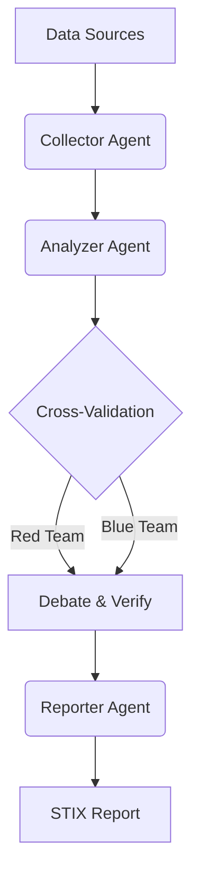

# OSINT Agent Network (OAN)


## 📌 Overview
**OSINT Agent Network (OAN)** is an automated Open Source Intelligence (OSINT) analysis system powered by Multi-Agent collaboration and Large Language Models (LLMs). It is designed to help security analysts extract high-value intelligence from massive unstructured data (forums, blogs, social media) with high efficiency and accuracy.

This project leverages the reasoning capabilities of **Xiaomi MiMo** and other leading LLMs to perform complex tasks such as cross-modal context reasoning, APT (Advanced Persistent Threat) tracking, and automated STIX report generation.

## 🚀 Key Features
- **Multi-Agent Architecture**: 
  - `Collector Agent`: Monitors and scrapes data from targeted sources.
  - `Analyzer Agent`: Performs multi-modal parsing and long-chain reasoning on text and images.
  - `Red/Blue Team Agents`: Conducts cross-validation and debate to eliminate false positives.
  - `Reporter Agent`: Aggregates verified intelligence and generates STIX-compliant reports.
- **High Throughput**: Capable of processing 100k+ raw messages daily.
- **Advanced Reasoning**: Utilizes Xiaomi MiMo's multi-modal capabilities for analyzing architecture diagrams and code snippets.

## 🏗️ Architecture



## 🛠️ Installation

```bash
git clone https://github.com/yourusername/osint-agent-network.git
cd osint-agent-network
pip install -r requirements.txt
```

## ⚙️ Configuration
Create a `.env` file in the root directory and configure your API keys:
```env
MIMO_API_KEY=your_mimo_api_key_here
OPENAI_API_KEY=your_openai_api_key_here
```

## 🏃‍♂️ Quick Start
Run the main pipeline:
```bash
python main.py --target "APT32 recent activities"
```

## 📝 Roadmap
- [x] Multi-Agent framework setup
- [x] Basic text-based reasoning
- [ ] Multi-modal image parsing integration (MiMo V2.5)
- [ ] Automated STIX 2.1 report generation
- [ ] Web UI dashboard

## 🤝 Contributing
Contributions are welcome! Please read our [Contributing Guidelines](CONTRIBUTING.md) for details.

## 📄 License
This project is licensed under the MIT License - see the [LICENSE](LICENSE) file for details.
